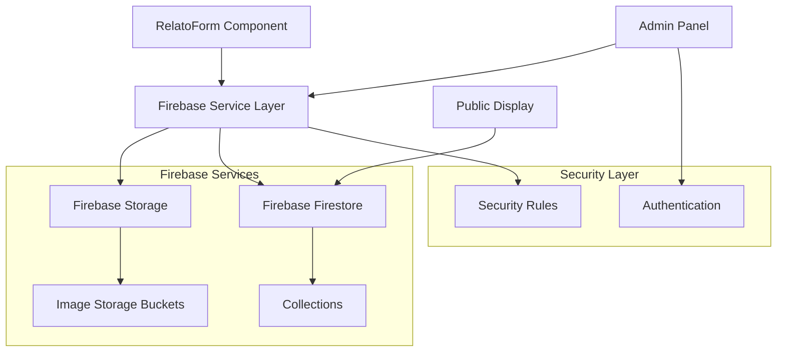

# Design Document

## Overview

This design outlines the Firebase integration architecture for the Portal Malvinas relatos and portal memoria functionality. The system will use Firebase Firestore for data storage and Firebase Storage for image management, with a focus on security, performance, and user experience. The design supports both unauthenticated user submissions and admin approval workflows.

## Architecture

### High-Level Architecture



### Data Flow

1. **Submission Flow**: User fills form → Images uploaded to Storage → Document created in Firestore → Success feedback
2. **Admin Flow**: Admin authenticates → Reviews pending submissions → Updates status → Content becomes public
3. **Display Flow**: Public pages query approved documents → Display content with images

## Components and Interfaces

### Firebase Configuration

```typescript
// firebase.config.ts
interface FirebaseConfig {
  apiKey: string
  authDomain: string
  projectId: string
  storageBucket: string
  messagingSenderId: string
  appId: string
}

interface FirebaseServices {
  firestore: Firestore
  storage: FirebaseStorage
  auth: Auth
}
```

### Firestore Schema

#### Relatos Collection
```typescript
interface RelatoDocument {
  id: string
  name: string
  surname: string
  phone: string
  title: string
  content: string // Markdown from BlockNote
  dni_image_url: string
  banner_image_url: string
  status: 'pending' | 'approved' | 'rejected'
  created_at: Timestamp
  updated_at: Timestamp
  approved_at?: Timestamp
  approved_by?: string
  admin_notes?: string
  metadata: {
    ip_address?: string
    user_agent?: string
    submission_source: 'web_form' | 'admin_upload'
  }
}
```

#### Portal Memoria Collection
```typescript
interface PortalMemoriaDocument {
  id: string
  name: string
  surname: string
  phone: string
  description: string
  dni_image_url: string
  image_url: string // Single image URL
  status: 'pending' | 'approved' | 'rejected'
  created_at: Timestamp
  updated_at: Timestamp
  approved_at?: Timestamp
  approved_by?: string
  admin_notes?: string
  metadata: {
    ip_address?: string
    user_agent?: string
    submission_source: 'web_form' | 'admin_upload'
  }
}
```

### Firebase Storage Structure

```
/relatos/
  /dni/
    /{timestamp}_{randomId}_{originalName}
  /banners/
    /{timestamp}_{randomId}_{originalName}

/portal-memoria/
  /dni/
    /{timestamp}_{randomId}_{originalName}
  /images/
    /{timestamp}_{randomId}_{originalName}

/admin_uploads/
  /relatos/
  /portal_memoria/
```

### Service Layer Architecture

#### Firebase Service Interface
```typescript
interface FirebaseService {
  // Image upload methods
  uploadDniImage(file: File, type: 'relatos' | 'portal-memoria'): Promise<string>
  uploadBannerImage(file: File): Promise<string>
  uploadPortalMemoriaImage(file: File): Promise<string>
  
  // Document operations
  createRelato(data: CreateRelatoData): Promise<string>
  createPortalMemoria(data: CreatePortalMemoriaData): Promise<string>
  
  // Admin operations
  getPendingSubmissions(type: 'relatos' | 'portal-memoria'): Promise<Document[]>
  approveSubmission(id: string, type: string, adminId: string): Promise<void>
  rejectSubmission(id: string, type: string, adminId: string, notes: string): Promise<void>
  
  // Public queries
  getApprovedRelatos(limit?: number): Promise<RelatoDocument[]>
  getApprovedPortalMemoria(limit?: number): Promise<PortalMemoriaDocument[]>
}
```

#### Image Processing Service
```typescript
interface ImageProcessingService {
  compressImage(file: File, maxSize: number): Promise<File>
  validateImageFile(file: File): ValidationResult
  generateUniqueFileName(originalName: string): string
  createThumbnail(file: File): Promise<File>
}
```

### Form Integration Design

#### Enhanced RelatoForm Component
```typescript
interface RelatoFormState {
  // Form data
  formData: RelatoFormData
  
  // Upload states
  dniUploadProgress: number
  bannerUploadProgress: number
  isUploading: boolean
  
  // Error handling
  errors: FormErrors
  submitError: string | null
  
  // Success state
  isSubmitted: boolean
  submissionId: string | null
}

interface RelatoFormActions {
  updateField: (field: string, value: any) => void
  uploadImage: (file: File, type: 'dni' | 'banner') => Promise<void>
  submitForm: () => Promise<void>
  resetForm: () => void
}
```

## Data Models

### Validation Schemas

```typescript
// Using Zod for runtime validation
const RelatoSubmissionSchema = z.object({
  name: z.string().min(2).max(50),
  surname: z.string().min(2).max(50),
  phone: z.string().regex(/^\d{10,15}$/),
  title: z.string().min(5).max(100),
  content: z.string().min(50).max(10000),
  dni_image: z.instanceof(File).refine(file => 
    file.size <= 5 * 1024 * 1024 && 
    ['image/jpeg', 'image/png', 'image/webp'].includes(file.type)
  ),
  banner_image: z.instanceof(File).refine(file => 
    file.size <= 10 * 1024 * 1024 && 
    ['image/jpeg', 'image/png', 'image/webp'].includes(file.type)
  )
})

const PortalMemoriaSubmissionSchema = z.object({
  name: z.string().min(2).max(50),
  surname: z.string().min(2).max(50),
  phone: z.string().regex(/^\d{10,15}$/),
  description: z.string().min(10).max(1000),
  dni_image: z.instanceof(File).refine(file => 
    file.size <= 5 * 1024 * 1024 && 
    ['image/jpeg', 'image/png', 'image/webp'].includes(file.type)
  ),
  image: z.instanceof(File).refine(file => 
    file.size <= 10 * 1024 * 1024 && 
    ['image/jpeg', 'image/png', 'image/webp'].includes(file.type)
  )
})
```

### Error Handling Models

```typescript
interface FormErrors {
  name?: string
  surname?: string
  phone?: string
  title?: string
  content?: string
  dni_image?: string
  banner_image?: string
  gallery_images?: string
  general?: string
}

interface UploadError {
  type: 'network' | 'file_size' | 'file_type' | 'quota' | 'unknown'
  message: string
  field: string
}
```

## Error Handling

### Error Categories and Responses

1. **Validation Errors**: Client-side validation with immediate feedback
2. **Upload Errors**: Network issues, file size/type problems, storage quota
3. **Submission Errors**: Firestore write failures, network timeouts
4. **Authentication Errors**: Admin login failures, token expiration

### Error Recovery Strategies

```typescript
interface ErrorRecoveryStrategy {
  retryableErrors: string[]
  maxRetries: number
  backoffStrategy: 'linear' | 'exponential'
  fallbackActions: {
    saveToLocalStorage: boolean
    showOfflineMessage: boolean
    enableRetryButton: boolean
  }
}
```

### User-Friendly Error Messages (Spanish)

```typescript
const ERROR_MESSAGES = {
  'file-too-large': 'El archivo es demasiado grande. Máximo {maxSize}MB.',
  'invalid-file-type': 'Tipo de archivo no válido. Solo se permiten imágenes.',
  'network-error': 'Error de conexión. Verifica tu internet e intenta nuevamente.',
  'upload-failed': 'Error al subir la imagen. Intenta nuevamente.',
  'submission-failed': 'Error al enviar el formulario. Intenta nuevamente.',
  'required-field': 'Este campo es obligatorio.',
  'invalid-phone': 'Número de teléfono inválido.',
  'content-too-short': 'El contenido debe tener al menos 50 caracteres.',
  'quota-exceeded': 'Servicio temporalmente no disponible. Intenta más tarde.'
} as const
```

## Testing Strategy

### Unit Testing

1. **Firebase Service Tests**: Mock Firebase SDK, test all service methods
2. **Validation Tests**: Test all validation schemas with valid/invalid data
3. **Image Processing Tests**: Test compression, validation, filename generation
4. **Error Handling Tests**: Test all error scenarios and recovery strategies

### Integration Testing

1. **Form Submission Flow**: End-to-end form submission with mocked Firebase
2. **Admin Workflow**: Test approval/rejection flows
3. **File Upload Flow**: Test image upload with various file types/sizes
4. **Security Rules Testing**: Test Firestore and Storage security rules

### Component Testing

1. **RelatoForm Component**: Test form interactions, validation, submission
2. **Admin Panel Components**: Test pending submissions display, approval actions
3. **Public Display Components**: Test approved content rendering

### Firebase Emulator Testing

```typescript
// Test configuration for Firebase emulators
const testConfig = {
  firestore: {
    host: 'localhost',
    port: 8080
  },
  storage: {
    host: 'localhost',
    port: 9199
  },
  auth: {
    host: 'localhost',
    port: 9099
  }
}
```

## Security Considerations

### Firestore Security Rules

```javascript
rules_version = '2';
service cloud.firestore {
  match /databases/{database}/documents {
    // Relatos collection
    match /relatos/{document} {
      // Allow unauthenticated users to create
      allow create: if isValidRelatoSubmission(resource.data);
      
      // Allow public read for approved documents
      allow read: if resource.data.status == 'approved';
      
      // Allow admin to read and update
      allow read, update: if isAdmin();
    }
    
    // Portal memoria collection
    match /portal-memoria/{document} {
      allow create: if isValidPortalMemoriaSubmission(resource.data);
      allow read: if resource.data.status == 'approved';
      allow read, update: if isAdmin();
    }
    
    // Helper functions
    function isAdmin() {
      return request.auth != null && 
             request.auth.token.admin == true;
    }
    
    function isValidRelatoSubmission(data) {
      return data.keys().hasAll(['name', 'surname', 'phone', 'title', 'content', 'dni_image_url', 'banner_image_url']) &&
             data.status == 'pending' &&
             data.name is string && data.name.size() > 0 &&
             data.surname is string && data.surname.size() > 0 &&
             data.phone is string && data.phone.matches('^[0-9]{10,15}$') &&
             data.title is string && data.title.size() > 0 &&
             data.content is string && data.content.size() > 0;
    }
    
    function isValidPortalMemoriaSubmission(data) {
      return data.keys().hasAll(['name', 'surname', 'phone', 'description', 'dni_image_url', 'image_url']) &&
             data.status == 'pending' &&
             data.name is string && data.name.size() > 0 &&
             data.surname is string && data.surname.size() > 0 &&
             data.phone is string && data.phone.matches('^[0-9]{10,15}$') &&
             data.description is string && data.description.size() > 0 &&
             data.image_url is string && data.image_url.size() > 0;
    }
  }
}
```

### Firebase Storage Security Rules

```javascript
rules_version = '2';
service firebase.storage {
  match /b/{bucket}/o {
    // Allow unauthenticated uploads to specific folders
    match /relatos/{allPaths=**} {
      allow write: if request.auth == null && 
                      resource == null && 
                      isValidImageUpload();
      allow read: if true; // Public read for approved content
    }
    
    match /portal-memoria/{allPaths=**} {
      allow write: if request.auth == null && 
                      resource == null && 
                      isValidImageUpload();
      allow read: if true;
    }
    
    // Admin uploads
    match /admin_uploads/{allPaths=**} {
      allow read, write: if isAdmin();
    }
    
    function isValidImageUpload() {
      return request.resource.size < 10 * 1024 * 1024 && // 10MB limit
             request.resource.contentType.matches('image/.*');
    }
    
    function isAdmin() {
      return request.auth != null && 
             request.auth.token.admin == true;
    }
  }
}
```

## Performance Optimizations

### Image Optimization Strategy

1. **Client-side compression** before upload
2. **Progressive upload** with progress indicators
3. **Thumbnail generation** for admin preview
4. **CDN integration** for fast image delivery

### Firestore Query Optimization

1. **Composite indexes** for admin queries
2. **Pagination** for large result sets
3. **Real-time listeners** only where necessary
4. **Offline persistence** for admin panel

### Caching Strategy

1. **Browser caching** for approved content
2. **Service worker caching** for offline functionality
3. **Firebase caching** for frequently accessed data