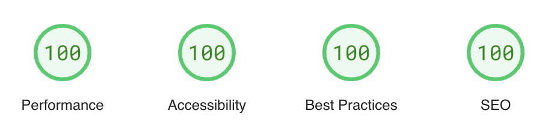

# Proyecto malvinas

[English](./README.md) | [简体中文](./README-zh-CN.md)

Un portal dedicado a relatos e historia de malvinas, propuesta por la universidad nacional de la plata.


### :white_check_mark: Puntuacion en Lighthouse 
El punto de concentracion principal del proyecto es la accesibilidad, por eso:
[](https://pagespeed.web.dev/analysis/https-cworld-top/o229zrt5o4?form_factor=mobile&hl=en)


## Desarrollo local

Requerimentos de desarrollo:

- [Nodejs](https://nodejs.org/): 18.0.0+


Comandos utiles:

```shell
bun install

bun dev

bun run build

bun preview

bun new-post
```
